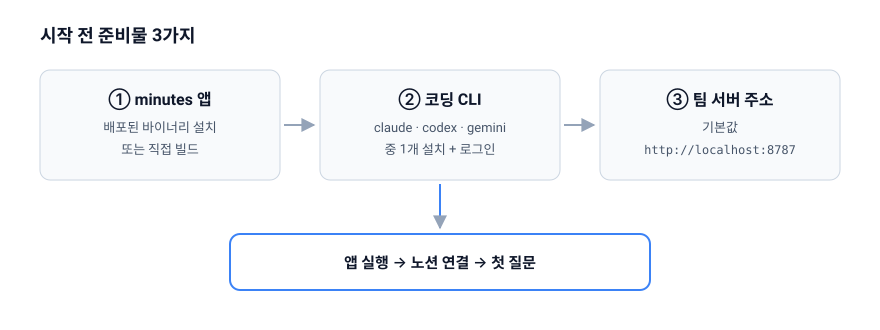

# 시작하기

minutes는 팀의 노션 회의록을 색인해 두고, 자연어 질문에 출처와 함께 답해 주는 데스크톱 앱입니다. 이 문서는 앱을 처음 받아서 첫 질문을 던지기까지의 과정을 안내합니다.

## 준비물



| 준비물 | 설명 |
| --- | --- |
| minutes 앱 | 팀에서 배포한 바이너리를 설치하거나, 저장소에서 직접 빌드합니다. |
| 코딩 CLI | 답변 생성 엔진입니다. `claude`, `codex`, `gemini` 중 하나가 로컬에 설치되어 있고 로그인된 상태여야 합니다. |
| 팀 서버 주소 | 색인과 검색을 담당하는 minutes 서버의 주소입니다. 기본값은 `http://localhost:8787`입니다. |

## 1. 코딩 CLI 준비하기

minutes에는 API 키를 입력하는 화면이 없습니다. 답변은 **로컬에 설치된 코딩 CLI를 앱이 직접 실행해서** 만들어집니다. 따라서 CLI가 없으면 답변이 나오지 않습니다.

- 지원 CLI: `claude`, `codex`, `gemini`
- 앱은 `<cli> --version`을 실행해 종료 코드가 0이면 설치된 것으로 판단합니다. 터미널에서 미리 확인해 보세요.
- 어떤 CLI를 쓸지 고르지 않으면(`auto`) `claude` → `codex` → `gemini` 순서로 감지해 가장 먼저 발견된 것을 사용합니다.
- 앱을 GUI(런처/Finder)에서 실행해도 PATH를 보정해 CLI를 찾습니다.

> ⚠️ 위 세 실행 파일만 앱에서 실행할 수 있도록 권한이 제한되어 있습니다. 다른 이름의 CLI나 셸 스크립트로 대체할 수 없습니다.

> ⚠️ 사용할 CLI는 앱 실행 후 첫 번째 답변을 만들 때 한 번 정해지고 그대로 캐시됩니다. CLI를 설치했거나 바꿨다면 앱을 재시작하세요.

CLI마다 출력 방식이 달라 체감 품질에 차이가 있습니다.

- `claude`: 토큰 단위 스트리밍이라 답변이 자연스럽게 흘러나옵니다.
- `codex`, `gemini`: 표준 출력을 줄 단위로 그대로 흘려보내므로, CLI가 찍는 배너나 경고 문구가 답변에 섞여 보일 수 있습니다.

한 번의 답변 생성은 최대 120초까지 기다립니다.

## 2. 앱 준비하기

이미 배포된 바이너리를 받았다면 이 절은 건너뛰고 3번으로 가세요. 직접 빌드한다면 저장소 루트에서 다음 명령을 사용합니다.

```bash
bun run tauri:dev    # 개발용 앱 창 실행
bun run tauri:build  # 배포용 바이너리 빌드
```

앱 창 제목은 `minutes`, 기본 크기는 800×600입니다. 앱 식별자는 `com.geongyu.minutes`입니다.

```bash
bun run dev          # 브라우저(:3000) 개발 모드
```

> ⚠️ 브라우저 개발 모드(`bun run dev`)에서는 **답변 생성이 동작하지 않습니다.** CLI 실행은 Tauri 앱 안에서만 가능하기 때문입니다. 화면 확인 용도로만 쓰세요.

## 3. 서버 주소와 CLI 지정하기

앱 설정은 `apps/desktop/.env.local` 파일로 지정합니다.

```bash
NEXT_PUBLIC_MINUTES_SERVER_URL=http://localhost:8787
NEXT_PUBLIC_LLM_CLI=auto   # claude | codex | gemini | auto
```

> ⚠️ 저장소의 `apps/desktop/.env.example`에는 `MINUTES_SERVER_URL`, `LLM_CLI`로 적혀 있어 **`NEXT_PUBLIC_` 접두어가 빠져 있습니다.** 그대로 복사하면 코드가 값을 읽지 못하고 기본값(`http://localhost:8787`, `auto`)으로 동작합니다.

> ⚠️ 이 값들은 **빌드 시점에 코드로 인라인됩니다.** 빌드된 앱의 설정을 바꾸려면 `.env.local`을 고친 뒤 다시 빌드해야 합니다.

> ⚠️ Tauri 앱의 네트워크 허용 범위가 `http://localhost:8787/*`로 하드코딩되어 있습니다. 서버 주소를 원격 호스트로 바꿔도 앱에서는 요청이 차단됩니다. 현재는 서버가 로컬에 떠 있거나 `localhost:8787`로 포워딩된 상태여야 합니다.

## 4. 첫 실행 화면

앱을 열면 채팅 화면 하나가 나옵니다.

- 헤더 왼쪽: 제목 `minutes`
- 헤더 가운데: **노션 연결** 버튼(또는 연결된 워크스페이스 이름)
- 헤더 오른쪽: 색인 상태(문서 수 · 청크 수 · 마지막 동기화 시각)와 **재색인** 버튼
- 본문: `회의록에 대해 물어보세요. / 예: "로그인 방식은 뭘로 정했지?"`
- 하단: 질문 입력창과 **전송** 버튼

## 5. 노션 연결하고 첫 질문 던지기

질문에 답하려면 먼저 노션 워크스페이스를 연결해야 합니다. 헤더의 **노션 연결** 버튼을 눌러 진행하세요. 자세한 절차는 [노션 워크스페이스 연결](02-notion-connect.md)에 있습니다.

> ⚠️ 노션을 연결하지 않은 상태에서 질문하면 서버가 요청을 인증하지 못해(401/403) 검색 단계에서 실패합니다. "답변 생성 실패" 메시지가 보인다면 연결 상태부터 확인하세요.

연결과 색인이 끝난 뒤 입력창에 질문을 적고 전송하면, 답변이 스트리밍되면서 아래에 출처가 함께 표시됩니다.

## 다음 문서

- [전체 목차](README.md)
- [노션 워크스페이스 연결](02-notion-connect.md)
- [질문과 답변](03-asking-questions.md)
- [문제 해결](06-troubleshooting.md)
