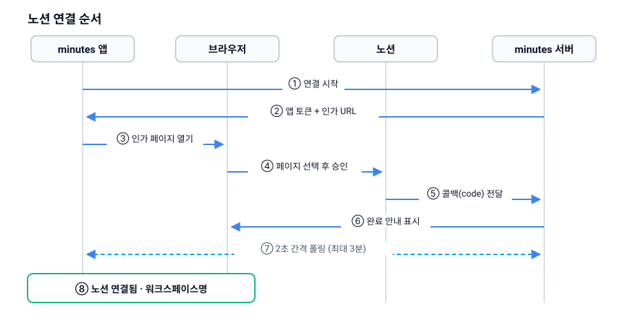

# 노션 워크스페이스 연결

minutes가 회의록을 읽으려면 노션 워크스페이스를 한 번 연결해야 합니다. 버튼 하나로 시작해서 브라우저에서 승인만 하면 끝나며, 인증 코드를 손으로 옮겨 붙이는 단계는 없습니다.

## 연결 순서

1. 헤더의 **노션 연결** 버튼을 누릅니다.
2. 앱이 서버에 연결을 요청하고, 서버가 **앱 토큰**과 **노션 인가 URL**을 내려줍니다.
3. 앱 토큰은 앱 안에 저장되어, 이후 모든 서버 요청에서 "나"를 식별하는 데 쓰입니다.
4. 기본 브라우저가 열리면서 노션 인가 페이지가 나타납니다.
5. 워크스페이스를 고르고, **minutes가 읽을 페이지를 선택**한 뒤 승인합니다.
6. 노션이 서버로 바로 결과를 돌려주고, 브라우저에 `노션 연결이 완료되었습니다. 창을 닫고 앱으로 돌아가세요.`가 표시됩니다.
7. 그동안 앱의 버튼은 **"노션에서 승인 대기 중…"** 으로 바뀌어 2초 간격으로 완료 여부를 확인합니다.
8. 완료되면 버튼이 **"노션 연결됨 · {워크스페이스명}"** 으로 바뀝니다.

브라우저 창은 닫아도 됩니다. 완료 판정은 앱이 서버에 직접 물어보는 방식이라 브라우저를 계속 열어 둘 필요가 없습니다.

앱을 껐다 켜도 저장된 앱 토큰으로 연결 상태를 다시 조회하므로, 연결 과정을 반복할 필요는 없습니다.

> ⚠️ 승인 대기는 **최대 3분**입니다. 인가 화면에서 오래 머무르면 `연결이 완료되지 않았습니다. 다시 시도해주세요.` 메시지가 나오며, 이때는 버튼을 다시 눌러 처음부터 진행하면 됩니다.

## 승인 대기 취소

승인 대기 중에는 버튼 옆에 **취소** 버튼이 나타납니다. 누르면 대기를 즉시 끝내고 취소 직전 상태로 돌아갑니다.

- 최초 연결 중이었다면 → **노션 연결** 버튼으로 되돌아갑니다.
- 연결 변경 중이었다면 → 기존 연결이 그대로 유지됩니다.

취소한 뒤 브라우저에서 승인을 마치더라도 그 결과는 무시되며, `유효하지 않은 요청입니다. 앱에서 다시 시도해주세요.`가 표시됩니다. 다시 연결하려면 앱에서 버튼을 새로 누르세요.

## 어떤 페이지가 검색되나요

색인 대상은 **인가 화면에서 직접 선택해 공유한 페이지와 그 하위 페이지**뿐입니다. 선택하지 않은 페이지는 노션 API가 접근을 거부(404)하므로 검색 결과에 절대 나타나지 않습니다.

나중에 회의록 페이지를 더 포함하고 싶다면:

1. 노션에서 해당 페이지를 열고, minutes 통합(integration)에 접근 권한을 추가합니다.
2. 앱 헤더의 **재색인** 버튼을 누릅니다.

## 연결 변경

연결된 상태에서는 워크스페이스 이름 옆에 **연결 변경** 버튼이 있습니다. 누르면 앱 토큰은 그대로 둔 채 인가 절차만 다시 진행합니다. 중간에 그만두어도 기존 연결은 그대로 유지됩니다.

> ⚠️ 다른 워크스페이스로 바꾸면 서버가 **이전 워크스페이스의 색인 데이터를 삭제합니다.** 워크스페이스 간에 내용이 섞여 검색되는 것을 막기 위한 동작이며, 되돌리려면 다시 색인해야 합니다.

> ⚠️ **연결을 완전히 해제하는 기능은 앱에도 서버에도 없습니다.** 접근을 끊으려면 노션 쪽에서 minutes 통합의 권한을 회수하거나 서버 운영자에게 문의하세요.

## 연결이 안 될 때

| 화면에 보이는 것 | 확인할 점 |
| --- | --- |
| `노션 연결에 실패했습니다: {원인}` | 서버 주소가 맞는지, 서버가 떠 있는지 확인합니다. 자세한 원인은 개발자 콘솔에도 남습니다. |
| `연결이 완료되지 않았습니다. 다시 시도해주세요.` | 3분을 초과했습니다. 버튼을 다시 눌러 주세요. |
| 브라우저에 `노션 연결이 취소되었습니다.` | 인가 화면에서 취소했습니다. 앱에서 다시 시도하세요. |
| 브라우저에 `유효하지 않은 요청입니다.` | 인가 링크가 만료되었거나 이미 사용되었습니다. 앱에서 처음부터 다시 시작하세요. |

> ⚠️ 서버에 아예 접속할 수 없을 때, 앱은 오류 대신 그냥 **"연결 안 됨"** 상태로 표시합니다. 분명히 연결했는데 버튼이 다시 나타난다면 연결이 풀린 것이 아니라 서버에 닿지 못하는 상황일 수 있습니다.

내부적으로 인가 요청에는 1회용 `state` 값이 붙고, 완료되면 즉시 무효화됩니다. 승인하지 않고 방치한 연결 시도는 1시간 뒤 정리됩니다. 노션 액세스 토큰은 서버에 보관되며, 색인 중 만료가 감지되면 갱신 토큰으로 한 번 자동 재발급한 뒤 재시도합니다.

## 다음 문서

- [전체 목차](README.md)
- [시작하기](01-getting-started.md)
- [질문과 답변](03-asking-questions.md)
- [색인과 최신화](04-indexing.md)
- [문제 해결](06-troubleshooting.md)
- [한계와 개인정보](08-limits-and-privacy.md)
