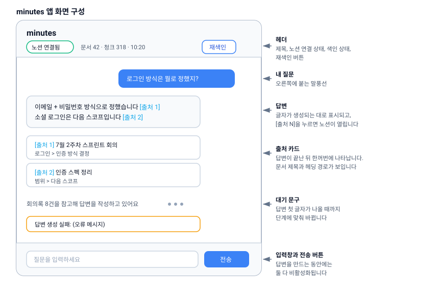
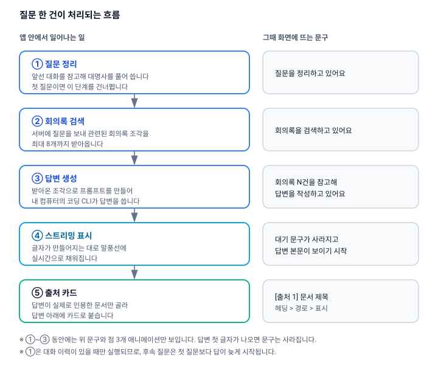

# 질문하고 답변 읽기

minutes는 화면 하나짜리 채팅 앱입니다. 아래에서 화면 구성, 질문이 처리되는 순서, 답변과 출처를 읽는 방법, 그리고 검색이 잘 되는 질문을 쓰는 요령을 안내합니다.

## 화면 구성

- **헤더** — 앱 이름 `minutes`, 노션 연결 상태, 색인 상태(문서 수 · 청크 수 · 마지막 동기화 시각)와 재색인 버튼이 있습니다. 색인 상태에 대해서는 [04-indexing.md](04-indexing.md)를 참고하세요.
- **본문** — 대화가 없을 때는 안내 문구가 보입니다.

  > 회의록에 대해 물어보세요.
  > 예: "로그인 방식은 뭘로 정했지?"

  질문을 보내면 내 말풍선과 답변 말풍선이 차례로 쌓이고, 답변 아래에 출처 카드가 붙습니다.
- **입력창** — 아래쪽에 `질문을 입력하세요` placeholder가 있는 입력창과 **전송** 버튼이 있습니다. 입력이 비어 있으면 전송 버튼이 눌리지 않고, 답변을 만드는 동안에는 입력창과 버튼이 모두 비활성화됩니다.
- **에러 배너** — 답변 생성이 실패하면 본문 아래에 `답변 생성 실패: {메시지}` 형태로 표시됩니다.

## 질문 한 건이 처리되는 순서

질문을 보내면 다음 순서로 진행됩니다. 답변 문장을 만드는 일은 전부 내 컴퓨터에서 실행되고, 서버는 회의록 검색만 담당합니다.

1. **질문 정리** — 앞선 대화를 참고해 `그거`, `거기` 같은 대명사를 풀어 쓴 질문으로 바꿉니다. **대화 이력이 있을 때만** 실행되므로 새 대화의 첫 질문에서는 건너뜁니다. 참고하는 범위는 최근 4턴(메시지 8개)까지입니다.
2. **회의록 검색** — 정리된 질문을 서버로 보내 관련된 회의록 조각을 최대 8개 받아옵니다.
3. **답변 생성** — 받아온 조각으로 프롬프트를 만들어 내 컴퓨터의 코딩 CLI가 답변을 씁니다.

답변 첫 글자가 나오기 전까지는 단계에 맞는 대기 문구와 점 3개 애니메이션이 보입니다.

| 단계 | 화면 문구 |
| --- | --- |
| 질문 정리 | 질문을 정리하고 있어요 |
| 검색 | 회의록을 검색하고 있어요 |
| 생성 | 회의록 N건을 참고해 답변을 작성하고 있어요 (참고할 문서가 없으면 "답변을 작성하고 있어요") |
| 그 밖 | 준비하고 있어요 |

> ⚠️ 1단계는 코딩 CLI를 한 번 더 실행합니다. 그래서 후속 질문은 첫 질문보다 답이 눈에 띄게 늦게 시작됩니다. 급할 때는 대명사를 직접 풀어 쓴 새 질문을 던지는 편이 빠릅니다.

## 답변과 출처 읽는 법

- 답변은 토큰 단위로 **실시간 스트리밍**되어 말풍선에 채워집니다.
- 본문 안의 **`[출처 1]`** 같은 표기가 인용 표시입니다. 누르면 해당 노션 원문이 열리고, 마우스를 올리면 문서 제목이 툴팁으로 뜹니다.
- **출처 카드**는 스트리밍이 모두 끝난 뒤 답변 아래에 한꺼번에 나타납니다. 카드에는 `[출처 N] 문서 제목`과 헤딩 경로(`상위 제목 > 중간 제목 > 소제목`)가 표시되고, 누르면 노션이 새 창으로 열립니다.
- 답변이 실제로 인용하지 않은 검색 결과는 카드로 뜨지 않습니다. 반대로 답변이 존재하지 않는 번호를 지어내면 그 번호는 버려집니다.

답변에는 다음과 같은 규칙이 지시되어 있습니다.

- 제공된 문서 범위 안에서만 답합니다.
- 문장마다 출처 번호를 붙입니다.
- 근거가 없으면 "제공된 문서에서 관련 내용을 찾지 못했습니다"라고 답하고, 어떤 문서를 확인했는지 알려줍니다.
- 문서끼리 내용이 충돌하면 양쪽을 모두 제시하고 어느 쪽이 최신인지 표시합니다.

> ⚠️ 위 규칙은 프롬프트로 부탁한 것일 뿐 코드로 강제되지 않습니다. 검색 결과가 0건이어도 그대로 모델에 전달되기 때문에, 드물게 근거 없는 답변이 나올 수 있습니다. **출처 카드가 하나도 없는 답변은 그대로 믿지 마세요.**

## 검색이 잘 되는 질문 쓰기

- **고유명사·기능명·사람 이름은 문서에 적힌 표기 그대로** 쓰세요. 키워드 검색이 공백 단위로 단어를 그대로 맞추는 방식이라, 조사를 붙이면(`배포를`) 원형(`배포`)과 매칭되지 않을 수 있습니다.
- **회의 이름이나 섹션 제목을 함께 넣으면 유리합니다.** 회의록 조각마다 `문서: {제목}`과 `위치: {헤딩 경로}`가 함께 저장되어 있어서, 제목 단어가 검색에 그대로 도움이 됩니다.
- **후속 질문의 대명사는 직접 풀어 쓰세요.** 새 대화에서는 질문 정리 단계가 아예 실행되지 않습니다.
- **대화가 길어지면 앞부분은 무시됩니다.** 메시지 8개(4턴)를 넘어가면 그 이전 맥락은 참조되지 않으니, 주제가 바뀌면 필요한 전제를 질문에 다시 적어 주세요.

## 알아둘 제약

> ⚠️ **대화 이력이 저장되지 않습니다.** 앱을 끄면 지금까지의 대화가 모두 사라집니다. 남겨야 할 답변은 직접 복사해 두세요.

> ⚠️ **생성을 중단하는 버튼이 없습니다.** 답변이 시작되면 끝날 때까지 기다려야 하며, 120초 타임아웃만 걸려 있습니다.

> ⚠️ **답변은 플레인 텍스트로 표시됩니다.** 마크다운 서식(굵게, 목록, 코드 블록)은 적용되지 않고 `[출처 N]`만 링크로 바뀝니다.

> ⚠️ **스트리밍이 중간에 끊기면 재접속하지 않습니다.** 재시도 기능이 없으므로 같은 질문을 다시 보내야 합니다.

## 다음 문서

- [04-indexing.md](04-indexing.md) — 색인이 언제 어떻게 갱신되는지
- [05-how-it-works.md](05-how-it-works.md) — 동작 원리
- [06-troubleshooting.md](06-troubleshooting.md) — 문제 해결
- [08-limits-and-privacy.md](08-limits-and-privacy.md) — 한계와 개인정보
- [README.md](README.md) — 전체 목차
