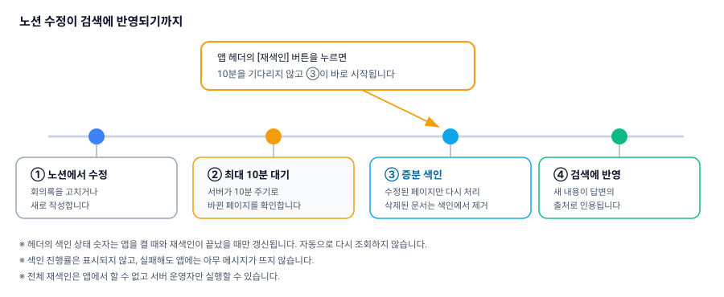

# 색인 갱신과 최신 내용 반영

노션 회의록은 그대로 검색되는 것이 아니라, 서버가 주기적으로 읽어 **색인**해 둔 내용이 검색됩니다. 이 문서는 색인이 언제 갱신되는지, 최신 내용이 답변에 나오지 않을 때 무엇을 확인하면 되는지 설명합니다.

## 색인은 언제 갱신되나요

서버가 **10분 주기로** 노션을 확인해 바뀐 페이지만 다시 색인합니다. "노션 문서를 고친 뒤 10분 안에 검색에 반영된다"가 이 앱이 목표로 하는 기준입니다.



- 매 회차에 노션의 마지막 수정 시각이 직전 동기화 시각보다 최신인 페이지만 다시 처리합니다(증분 색인).
- 마지막 동기화 시각은 색인이 **시작된 시각**으로 기록됩니다. 그래서 색인이 도는 도중에 고친 문서도 다음 회차에 빠짐없이 잡힙니다.
- 노션에서 삭제했거나 공유를 해제한 문서는 매 회차마다 색인에서 제거됩니다.
- 한 문서의 색인이 실패해도 나머지 문서는 계속 진행됩니다.

> ⚠️ 개별 문서의 색인 실패는 **서버 로그에만 남고 앱에는 표시되지 않습니다.** 특정 회의록만 계속 검색되지 않는다면 서버 운영자에게 문의하세요([07-server-admin.md](07-server-admin.md)).

> ⚠️ 색인에는 외부 임베딩 API(Gemini)를 사용합니다. 무료 티어 사용량 한도에 걸리면 색인이 지연되거나 중단될 수 있고, 그 사이 최신 문서는 검색되지 않습니다.

## 색인 상태 확인과 재색인

헤더의 색인 상태 표시에서 현재 색인 규모와 마지막 동기화 시각을 볼 수 있습니다.

```
문서 42 · 청크 318 · 2026-07-22 10:20
```

아직 한 번도 동기화한 적이 없으면 **"동기화 전"** 이라고 표시됩니다.

10분을 기다리기 어렵다면 헤더의 **[재색인]** 버튼을 누르세요. 버튼을 누르면 증분 색인이 즉시 시작되고, 그동안 라벨이 **"색인 중…"** 으로 바뀌며 비활성화됩니다. 끝나면 상태 숫자가 다시 조회됩니다.

> ⚠️ 색인 상태는 **앱을 켤 때 한 번만** 조회되고 자동으로 갱신되지 않습니다. 서버가 알아서 돌린 10분 주기 색인 결과는 앱을 다시 열기 전까지 숫자에 반영되지 않습니다.

> ⚠️ 색인 진행률(몇 건 중 몇 건)이 표시되지 않습니다. 완료될 때까지 "색인 중…"만 보입니다.

> ⚠️ 재색인이 실패해도 화면에 아무 메시지가 뜨지 않고 버튼만 원래대로 돌아옵니다. 눌렀는데 아무것도 달라지지 않았다면 실패했을 수 있습니다.

> ⚠️ 상태 조회 자체가 실패하면 조용히 무시되어 숫자가 아예 보이지 않습니다.

> ⚠️ 앱에서 할 수 있는 것은 **증분 재색인뿐입니다.** 전체 재색인은 서버에서 `bun run index:all`로만 실행할 수 있습니다.

## 색인되지 않는 것

다음 내용은 아무리 기다려도 검색되지 않습니다. 검색이 필요하다면 **본문 텍스트로 옮겨 적어야** 합니다.

- **노션 인가 화면에서 선택해 공유하지 않은 페이지** — 서버가 접근할 수 없습니다. 연결 시 페이지 선택 방법은 [02-notion-connect.md](02-notion-connect.md)를 참고하세요.
- **이미지 안의 글자** — 스크린샷으로 붙여 넣은 회의록은 글자가 전혀 추출되지 않습니다.
- **이미지·파일 블록** — **캡션 텍스트만** 색인되고, 캡션이 없으면 통째로 버려집니다.
- **embed, bookmark, video, pdf, 수식, synced block, 컬럼 레이아웃, 목차, breadcrumb** — 텍스트가 전혀 남지 않습니다.
- **노션 데이터베이스의 속성값(담당자·상태·날짜 등)과 데이터베이스 블록 자체** — 데이터베이스의 각 "행" 페이지 **본문**은 색인되지만, 속성값은 포함되지 않습니다. 담당자나 마감일로 검색하고 싶다면 본문에도 적어 두세요.
- **블록 중첩 깊이 10을 넘어가는 부분** — 그 아래는 수집이 중단됩니다.

## 최신 내용이 답변에 안 나올 때

순서대로 확인해 보세요.

1. **10분이 지났는지** 확인합니다. 아직이라면 헤더의 [재색인] 버튼을 누르고 "색인 중…"이 사라질 때까지 기다립니다.
2. **색인 상태의 마지막 동기화 시각**을 봅니다. 노션을 고친 시각보다 이전이라면 아직 반영되지 않은 것입니다. 이 숫자는 자동 갱신되지 않으니 앱을 다시 열어 확인하세요.
3. **해당 페이지가 노션 연결에 포함되어 있는지** 확인합니다. 공유하지 않은 페이지는 색인 대상이 아닙니다.
4. **찾으려는 내용이 위의 "색인되지 않는 것"에 해당하는지** 확인합니다. 이미지나 데이터베이스 속성이라면 본문 텍스트로 옮겨 적어야 합니다.
5. **질문에 쓴 표기가 문서와 같은지** 확인합니다. 검색 요령은 [03-asking-questions.md](03-asking-questions.md)에 있습니다.
6. 그래도 해결되지 않으면 [06-troubleshooting.md](06-troubleshooting.md)를 확인하고, 서버 쪽 문제로 보이면 운영자에게 문의하세요.

## 다음 문서

- [05-how-it-works.md](05-how-it-works.md) — 동작 원리
- [06-troubleshooting.md](06-troubleshooting.md) — 문제 해결
- [07-server-admin.md](07-server-admin.md) — 서버 운영자용
- [08-limits-and-privacy.md](08-limits-and-privacy.md) — 한계와 개인정보
- [README.md](README.md) — 전체 목차
