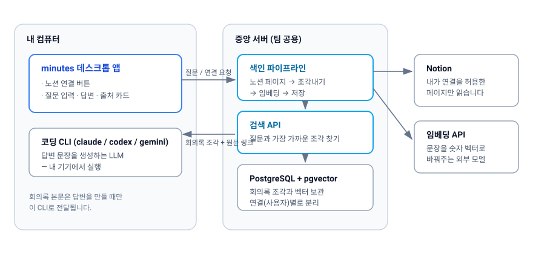
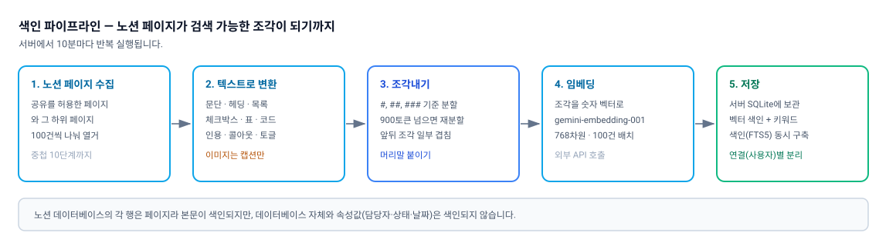
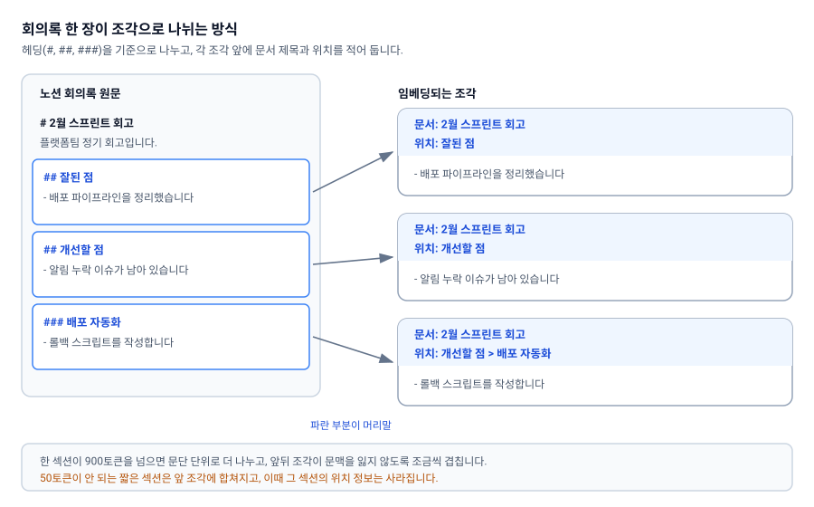
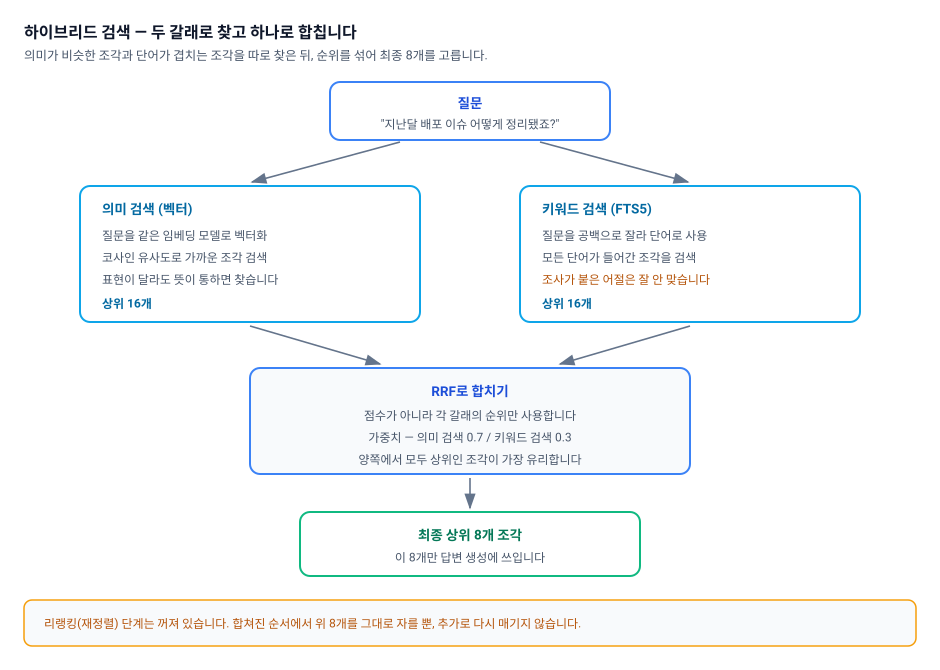

# 동작 원리

minutes가 노션 회의록을 어떻게 읽어 두고, 질문을 받았을 때 어떤 과정을 거쳐 답과 출처를 내놓는지 설명합니다. 답변이 이상할 때 원인을 짐작하는 데 도움이 되도록, 잘 동작하는 부분뿐 아니라 한계도 함께 적었습니다.



크게 보면 두 가지 일이 따로 돌아갑니다.

- **미리 해 두는 일(색인)** — 서버가 노션 페이지를 읽어 조각으로 잘라 두고, 각 조각을 검색 가능한 형태로 저장합니다.
- **질문할 때 하는 일(검색 + 답변 생성)** — 서버가 질문과 관련 있는 조각 8개를 찾아 주고, 실제 답변 문장은 여러분 컴퓨터에서 만들어집니다.

---

## 1. 미리 해 두는 일 — 색인



### 어떤 페이지를 읽나요

노션 인가 화면에서 **직접 선택해 공유한 페이지와 그 하위 페이지**만 읽습니다. 서버는 접근이 허용된 페이지를 100건씩 나눠 훑습니다. 하위 페이지는 부모에 딸린 내용이 아니라 **별개의 문서**로 색인되며, 블록 중첩이 10단계를 넘어가면 그 아래는 읽지 않습니다.

### 어떤 내용이 남고, 어떤 내용이 사라지나요

읽어서 텍스트로 옮기는 블록은 다음과 같습니다.

- 문단, 제목(heading 1~3)
- 불릿 목록, 번호 목록
- 체크박스(체크했는지 여부까지)
- 토글(펼친 내용을 굵은 글씨로 펼쳐서 저장)
- 코드 블록(언어 표시 포함), 인용, 콜아웃
- 표(마크다운 표로 변환), 구분선
- 이미지·파일의 **캡션**

> ⚠️ 위 목록에 없는 블록은 전부 무시됩니다. 임베드, 북마크, 동영상, PDF, 수식, 동기화 블록, 컬럼 레이아웃, 목차, 이동 경로, 페이지 링크 등이 여기에 해당합니다. **이미지 안에 적힌 글자도 남지 않습니다.** 회의록 캡처 이미지만 붙여 둔 페이지는 사실상 빈 페이지로 취급됩니다.

> ⚠️ 노션 데이터베이스는 각 "행"이 페이지이므로 그 **본문은** 색인됩니다. 하지만 **데이터베이스 자체와 속성값(담당자, 상태, 날짜 등)은 색인되지 않습니다.** "상태가 진행 중인 항목 알려줘" 같은 질문에는 답하기 어렵습니다.

### 조각내기(청킹)

긴 회의록을 통째로 다루면 검색이 뭉툭해지므로, 문서를 의미 단위로 잘라 둡니다.



- `#`, `##`, `###` 제목을 기준으로 섹션을 나누고, 어느 제목 아래였는지 경로를 유지합니다.
- 한 섹션이 900토큰을 넘으면 빈 줄(문단) 기준으로 더 잘게 나눕니다. 목표 크기는 600토큰입니다.
- 나뉜 조각끼리 문맥이 끊기지 않도록 약 72토큰(600의 12%)만큼 겹쳐 둡니다.
- 각 조각에는 문서 제목, 노션 원문 링크, 제목 경로, 최종 수정 시각, 토큰 수가 함께 저장됩니다.

가장 중요한 부분은 **머리말**입니다. 검색에 쓰이는 본문 앞에 항상 다음이 붙습니다.

```
문서: {페이지 제목}
위치: {헤딩1 > 헤딩2}

{본문}
```

덕분에 본문에 "그 건" 정도로만 적혀 있어도, 문서 제목과 제목 경로에 담긴 단어로 검색이 걸립니다. **회의록 제목과 소제목을 성의 있게 적는 것이 검색 품질에 가장 크게 기여합니다.**

> ⚠️ `####` 이하(heading 4 이상)는 제목으로 인식되지 않고 그냥 본문 취급됩니다. 문서 구조를 `###`까지만 쓰시는 편이 좋습니다.

> ⚠️ 50토큰이 안 되는 짧은 섹션은 앞 조각에 합쳐집니다. 이때 **그 섹션의 원래 제목 경로는 사라집니다.** 한 줄짜리 결론만 담긴 소제목은 위치 정보를 잃을 수 있습니다.

> ⚠️ 토큰 수는 gpt-4 인코딩 기준으로 셉니다. 실제 임베딩 모델의 토크나이저와는 다르므로, 위 숫자들은 정확한 값이 아니라 근사치입니다.

### 임베딩과 저장

각 조각은 Gemini `gemini-embedding-001` 모델로 768차원 숫자 벡터로 바뀝니다(100건씩 묶어 처리). 이 벡터와 원문 조각이 서버의 SQLite에 저장되고, 동시에 키워드 검색용 색인(FTS5)도 만들어집니다. 색인할 때와 질문할 때 **같은 임베딩 모델**을 씁니다.

---

## 2. 질문할 때 하는 일 — 검색



### 질문 다듬기

대화 이력이 있을 때만, 여러분 컴퓨터의 로컬 CLI가 대명사("그거", "아까 그 건")를 풀어서 검색어를 다시 만듭니다. **첫 질문은 입력한 그대로 검색합니다.**

### 두 갈래로 찾습니다

| 갈래 | 방식 | 강점 |
| --- | --- | --- |
| 의미 검색 | 질문을 벡터로 바꿔 코사인 유사도가 높은 조각을 찾음 | 표현이 달라도 뜻이 통하면 찾아냄 |
| 키워드 검색 | SQLite FTS5로 단어가 실제로 들어간 조각을 찾음 | 고유명사·용어·이름을 정확히 집어냄 |

각 갈래에서 16개씩(최종 개수의 2배) 가져옵니다.

### RRF로 합칩니다

두 결과는 **RRF(Reciprocal Rank Fusion)** 로 합쳐집니다. 유사도 점수가 아니라 **각 갈래에서 몇 등이었는지(순위)** 만 사용하는 방식이라, 두 검색의 점수 체계가 달라도 공정하게 섞입니다. 가중치는 의미 검색 0.7, 키워드 검색 0.3입니다. 양쪽에서 모두 상위권에 든 조각이 가장 유리합니다.

합친 결과에서 **상위 8개**만 남아 답변 생성으로 넘어갑니다.

> ⚠️ 한국어 키워드 검색에는 한계가 있습니다. FTS5는 공백 단위로만 단어를 자르고 형태소 분석을 하지 않습니다. 질문을 공백으로 잘라 **모든 단어가 들어간** 조각을 찾기 때문에, 조사가 붙은 "배포를"은 원문의 "배포"와 매칭되지 않습니다. 검색이 잘 안 될 때는 **조사를 떼고 핵심 명사만** 넣어 보세요.

> ⚠️ 리랭킹(찾아온 결과를 더 정교한 모델로 다시 줄 세우는 단계)은 꺼져 있으며, 구현체 자체가 없습니다. 현재는 합쳐진 순서에서 위 8개를 그대로 자를 뿐입니다.

### 내 회의록만 검색됩니다

모든 검색 질의에는 연결 ID 필터가 걸립니다. 앱 토큰으로 사용자를 식별하므로, **다른 사람이 연결한 워크스페이스의 내용은 검색되지 않습니다.**

---

## 3. 답변 문장 만들기

**답변은 서버가 아니라 여러분 컴퓨터에서 만들어집니다.** 데스크톱 앱이 로컬에 설치된 코딩 CLI(claude / codex / gemini)를 실행해 문장을 생성합니다.

CLI에 전달되는 프롬프트는 이런 구조입니다.

```
{시스템 규칙}

다음 문서들을 참고해서 질문에 답하세요.

[출처 1]
문서: 2월 스프린트 회고
위치: 개선할 점 > 배포 자동화
최종 수정: 2026-02-14
---
{조각 본문}

===

[출처 2]
...

질문: {질문 내용}
```

답변 안의 인용은 `[출처 N]` 형식이며, 실제로 존재하지 않는 번호는 걸러집니다. 출처 카드에 붙은 노션 링크로 원문을 바로 열어 확인하실 수 있습니다.

> ⚠️ 출력 길이 상한이나 temperature(무작위성) 설정이 없습니다. 유일한 제한은 **CLI 타임아웃 120초**입니다. 프롬프트 크기는 최대 8조각 × 900토큰이므로 대략 7천 토큰대입니다.

---

## 4. 검색 품질은 어떻게 확인하나요

- 지표는 **Recall@8** — 상위 8개 결과 안에 정답 문서가 들어 있는 비율입니다.
- 목표는 평균 Recall@8 ≥ 0.8이고, 미달이면 평가 명령(`bun run eval`)이 실패로 끝납니다.
- 검색 결과를 한 건만 눈으로 확인하려면 서버에서 `bun run search "질문"`을 실행합니다.

> ⚠️ **평가 세트가 아직 비어 있습니다.** 평가용 질문·정답 목록이 전부 주석 처리되어 있어, Recall@8 ≥ 0.8은 목표치일 뿐 **한 번도 실제로 측정된 적이 없습니다.** "검색 파라미터를 감으로 바꾸지 않는다"는 프로젝트 규칙도 현재로서는 지킬 수 없는 상태입니다.

---

## 5. 조절 가능한 값

아래 값은 모두 **코드 상수**입니다. 앱 화면에서 바꿀 수 없고, 운영자가 바꾸려면 **재빌드가 필요하며 청킹·임베딩 관련 값을 바꿨다면 전체 재색인도 필요합니다.**

### 서버 (`apps/server/src/config.ts`)

| 항목 | 값 |
| --- | --- |
| 조각 목표 크기 | 600토큰 |
| 조각 최대 크기 | 900토큰 |
| 조각 겹침 비율 | 0.12 |
| 조각 최소 크기 | 50토큰 |
| 임베딩 모델 | gemini-embedding-001 |
| 임베딩 차원 / 배치 | 768차원 / 100건 |
| 검색 결과 수(top-k) | 8 (API로 1~50 지정 가능) |
| RRF 가중치 | 의미 0.7 / 키워드 0.3 |
| RRF 상수(rrfK) | 60 |
| 리랭커 | 꺼짐 |
| 동기화 주기 | 10분 |
| 서버 포트 | 8787 |

### 데스크톱 앱 (`apps/desktop/src/config.ts`)

| 항목 | 값 |
| --- | --- |
| 서버 주소 | 빌드 시 지정 |
| 사용할 CLI | auto(자동 선택) |
| CLI 타임아웃 | 120초 |
| 참조할 대화 턴 수 | 4턴(메시지 8개) |

---

## 다음 문서

- [README.md](README.md) — 문서 전체 목차
- [01-getting-started.md](01-getting-started.md) — 설치와 첫 실행
- [02-notion-connect.md](02-notion-connect.md) — 노션 연결하기
- [03-asking-questions.md](03-asking-questions.md) — 질문하고 출처 확인하기
- [04-indexing.md](04-indexing.md) — 색인과 동기화
- [06-troubleshooting.md](06-troubleshooting.md) — 문제 해결
- [07-server-admin.md](07-server-admin.md) — 서버 운영자 가이드
- [08-limits-and-privacy.md](08-limits-and-privacy.md) — 한계와 개인정보
