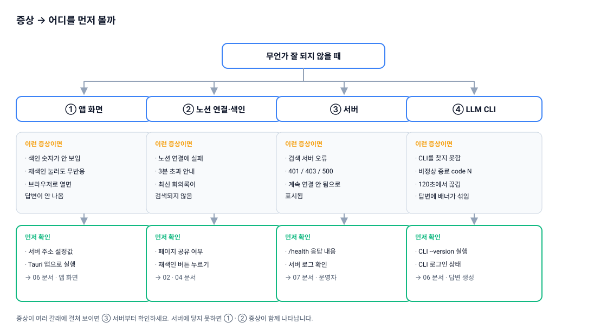

# 문제 해결

minutes를 쓰다가 막혔을 때 어디를 먼저 봐야 하는지, 화면에 뜬 메시지가 무슨 뜻인지 정리했습니다. 문서 안에 오류 문구를 그대로 실어 두었으니, 화면에 보이는 문장을 그대로 검색해서 찾아보셔도 됩니다.

## 어디부터 볼까요

문제는 대체로 **앱 화면 · 노션 연결 · 서버 · LLM CLI** 네 갈래 중 하나에서 시작됩니다. 여러 증상이 한꺼번에 나타난다면 **서버부터** 확인하세요. 앱이 서버에 닿지 못하면 색인 상태와 노션 연결 상태가 동시에 이상하게 보입니다.

## 증상별 확인표

### 앱 화면

| 증상 | 원인 | 해결 |
| --- | --- | --- |
| 색인 상태 숫자(문서 수·조각 수)가 아예 표시되지 않음 | 상태 조회가 실패했지만 앱이 오류를 조용히 무시합니다. 서버가 꺼져 있거나 노션 연결이 아직 완료되지 않은 상태입니다. | 서버가 떠 있는지, 노션 연결이 끝났는지 확인합니다. |
| 노션이 **연결 안 됨**으로 보이는데 분명히 연결했음 | 연결이 풀린 것이 아니라 서버에 접속하지 못하는 상황일 수 있습니다. | 서버 주소와 서버 기동 상태를 확인합니다. 운영자에게 문의하세요. |
| **재색인** 버튼을 눌렀는데 아무 일도 일어나지 않음 | 색인 요청이 실패해도 별도 메시지 없이 버튼만 원래 상태로 돌아갑니다. | 잠시 뒤 다시 시도하고, 계속 그렇다면 서버 로그 확인을 운영자에게 요청하세요. |
| `bun run dev`로 브라우저에서 열었더니 답변이 전혀 생성되지 않음 | 답변 생성에 쓰는 LLM CLI 실행은 Tauri 앱 안에서만 동작합니다. | 데스크톱 앱(Tauri)으로 실행하세요. |

> ⚠️ Tauri 권한 설정(`src-tauri/capabilities/default.json:29-33`)의 HTTP 허용 범위가 `http://localhost:8787/*`로 하드코딩되어 있습니다. 서버 주소를 원격 주소로 바꿔도 앱이 요청을 차단하므로, 현재는 로컬 주소 외에는 동작하지 않습니다.

> ⚠️ `apps/desktop/.env.example`의 변수 이름에 `NEXT_PUBLIC_` 접두어가 빠져 있습니다. 실제 코드가 읽는 이름은 `NEXT_PUBLIC_MINUTES_SERVER_URL`과 `NEXT_PUBLIC_LLM_CLI`입니다. 예시 파일을 그대로 복사했다면 이름을 고쳐 주세요.

### 노션 연결

| 증상 | 원인 | 해결 |
| --- | --- | --- |
| `노션 연결에 실패했습니다: {원인}` | 서버에 연결 세션을 요청하지 못했습니다. 세부 원인은 `노션 연결 시작 실패 ({status})` 또는 `연결 상태 조회 실패 ({status})` 형태로 붙습니다. | 서버 주소와 기동 상태를 확인한 뒤 다시 시도합니다. |
| `연결이 완료되지 않았습니다. 다시 시도해주세요.` | 앱은 2초 간격으로 최대 3분간 승인 완료를 기다립니다. 브라우저 승인이 그 안에 끝나지 않았습니다. | **노션 연결** 버튼을 다시 눌러 처음부터 진행합니다. |
| 브라우저에 `노션 연결이 취소되었습니다. 창을 닫아주세요.` | 인가 화면에서 취소를 눌렀습니다. | 앱에서 다시 시도합니다. |
| 브라우저에 `유효하지 않은 요청입니다. 앱에서 다시 시도해주세요.` | 인가 링크가 만료되었거나 이미 사용되었습니다. | 앱에서 처음부터 다시 시작합니다. |

승인이 정상적으로 끝나면 브라우저에 `노션 연결이 완료되었습니다. 창을 닫고 앱으로 돌아가세요.`가 표시됩니다. 이 문장을 봤다면 브라우저 창은 닫아도 됩니다.

### 검색 결과와 색인

| 증상 | 원인 | 해결 |
| --- | --- | --- |
| 방금 쓴 회의록이 검색되지 않음 | 자동 동기화는 10분 주기입니다. | 잠시 기다리거나 **재색인** 버튼을 누릅니다. |
| 재색인해도 특정 페이지가 안 나옴 | 노션 인가 화면에서 그 페이지를 공유하지 않았습니다. | 노션에서 해당 페이지에 minutes 통합 권한을 추가한 뒤 재색인합니다. |
| 회의록 안의 이미지·임베드·데이터베이스 속성 내용이 검색되지 않음 | 해당 요소들은 애초에 색인 대상이 아닙니다. | 필요한 내용은 본문 텍스트로 적어 주세요. |

### 답변 품질

| 증상 | 해볼 것 |
| --- | --- |
| 답변이 엉뚱한 회의를 가져옴 | 고유명사를 **문서에 적힌 표기 그대로** 넣습니다. |
| 원하는 내용이 안 나옴 | 회의 제목이나 섹션 이름을 질문에 함께 씁니다. |
| 후속 질문의 답이 이상함 | "그거", "거기" 같은 대명사를 풀어서 다시 물어봅니다. |
| 후속 질문이 유난히 느림 | 후속 질문은 이전 맥락을 반영해 질문을 다시 쓰는 과정을 거치므로 CLI가 한 번 더 실행됩니다. 정상 동작입니다. |

### 답변 생성 (LLM CLI)

답변 생성이 실패하면 화면에 `답변 생성 실패: {message}` 배너가 뜹니다. `{message}` 자리에 들어오는 문구별 대응입니다.

**`검색 서버 오류 ({status}): {본문}`**

서버 쪽에서 온 오류입니다. `{본문}`에 실제 원인이 담겨 있습니다.

| 본문 | 뜻 | 해결 |
| --- | --- | --- |
| `앱 토큰이 필요합니다. 노션을 먼저 연결하세요.` (401) | 앱 토큰이 없거나 무효합니다. | 노션 연결을 다시 진행합니다. |
| `노션 연결이 완료되지 않았습니다.` (403) | 연결이 승인 대기 상태입니다. | 브라우저에서 인가를 마칩니다. |
| `알 수 없는 경로입니다` (404) | 서버 주소나 경로가 잘못되었습니다. | 서버 주소 설정을 확인합니다. |
| `요청 처리에 실패했습니다` (500) | 서버 내부 오류입니다. | 운영자에게 서버 로그 확인을 요청하세요. |
| 응답 자체가 없음 | 서버가 떠 있지 않습니다. | 운영자에게 문의하세요. |

**`사용 가능한 LLM CLI를 찾지 못했습니다 (claude, codex, gemini). 하나를 설치·로그인한 뒤 다시 시도하세요. NEXT_PUBLIC_LLM_CLI 환경 변수로 지정할 수도 있습니다.`**

세 CLI 중 어느 것도 찾지 못했습니다. `claude`, `codex`, `gemini` 중 하나를 설치하고 로그인하세요. 특정 CLI를 쓰게 하려면 `NEXT_PUBLIC_LLM_CLI` 환경 변수로 지정합니다.

**`{provider} CLI가 비정상 종료했습니다 (code N). 터미널에서 '{provider} --version'과 로그인 상태를 확인하세요.`**

메시지 뒤에 CLI가 출력한 오류 내용(stderr)이 함께 붙습니다. 안내대로 터미널에서 `{provider} --version`을 실행해 보고, 로그인이 풀리지 않았는지 확인하세요.

**기타**

| 증상 | 원인 | 해결 |
| --- | --- | --- |
| 답변이 120초쯤에서 끊김 | CLI 실행 타임아웃입니다. | 질문을 짧게 나눠 다시 물어봅니다. 생성 중 중단 버튼은 없습니다. |
| 답변에 CLI 배너·경고 문구가 섞임 | CLI가 출력한 내용을 그대로 화면에 흘려보내기 때문입니다. `codex`·`gemini`에서 특히 자주 보입니다. | `claude` CLI를 사용하면 대체로 깔끔해집니다. |

## 다음 문서

- [전체 목차](README.md)
- [시작하기](01-getting-started.md)
- [노션 워크스페이스 연결](02-notion-connect.md)
- [질문과 답변](03-asking-questions.md)
- [색인과 최신화](04-indexing.md)
- [동작 원리](05-how-it-works.md)
- [서버 운영](07-server-admin.md)
- [한계와 개인정보](08-limits-and-privacy.md)
