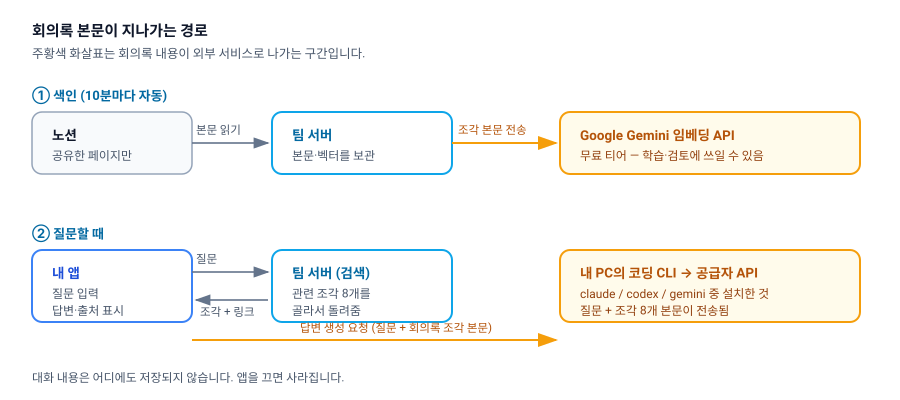

# 한계와 개인정보

minutes를 쓰기 전에 알아두어야 할 것들입니다. 회의록 내용이 어디까지 나가는지, 이 서비스가 아직 하지 못하는 일이 무엇인지 정리했습니다.

---

## 1. 내 회의록은 어디까지 나가나요

minutes를 쓰면 회의록 본문이 **세 곳**을 지나갑니다.

| 지나가는 곳 | 무엇이 전달되나 | 언제 |
|---|---|---|
| **팀 서버** | 공유한 노션 페이지의 본문 전체 | 색인할 때(10분마다) |
| **Google Gemini 임베딩 API** | 회의록 조각 본문 | 색인할 때, 그리고 질문할 때(질문 문장) |
| **내 PC의 코딩 CLI** → 해당 CLI 공급자 | 질문 + 검색된 조각 8개의 본문 | 질문할 때마다 |

### Gemini 임베딩 API — 가장 주의할 지점

> ⚠️ 현재 임베딩은 **Gemini API 무료 티어**를 사용합니다. 무료 티어는 제출한 내용이 Google의 제품 개선·학습에 사용될 수 있고 사람이 검토할 수도 있습니다. 즉 **회의록 본문이 외부로 나갑니다.**

이는 모르고 벌어진 일이 아니라, 서버 자원이 부족한 상황에서 **알고 선택한 한시적 조치**입니다. 서버 자원에 여유가 생기면 Ollama 자체 호스팅으로 되돌리는 것이 계획입니다.

따라서 **외부에 나가면 안 되는 내용이 담긴 페이지는 minutes에 공유하지 마세요.** 노션 인가 화면에서 페이지를 고를 때가 유일한 통제 지점입니다([노션 연결](02-notion-connect.md) 참고).

### 답변 생성 — 내 PC에서 실행되지만 외부로 나갑니다

답변 문장은 팀 서버가 아니라 **내 PC에 설치된 코딩 CLI**(`claude` / `codex` / `gemini`)가 만듭니다. 다만 "내 PC에서 실행된다"는 것이 "밖으로 안 나간다"는 뜻은 아닙니다. CLI는 결국 각 공급자의 API를 호출하므로, 질문과 함께 **검색된 회의록 조각 본문이 그 공급자에게 전송됩니다.**

어느 CLI를 쓰는지에 따라 데이터가 가는 곳이 달라집니다. 회사 정책상 특정 공급자만 허용된다면 `NEXT_PUBLIC_LLM_CLI`로 고정하세요([시작하기](01-getting-started.md)).

---

## 2. 무엇이 저장되고 무엇이 저장되지 않나요

**저장되는 것 (팀 서버의 SQLite 파일)**

- 노션 페이지 메타데이터(제목, 원문 링크, 최종 수정 시각)
- 회의록 조각 본문과 그 임베딩 벡터
- 내 노션 워크스페이스 정보와 **노션 액세스 토큰**
- 마지막 동기화 시각

**저장되지 않는 것**

- **대화 이력** — 앱을 끄면 주고받은 질문과 답변이 사라집니다. 서버에도 남지 않습니다. 남겨야 할 답변은 직접 복사해 두세요.
- 답변 본문(생성 즉시 화면에만 표시됨)

노션 액세스 토큰은 서버 DB에 **AES-256-GCM으로 암호화되어** 저장됩니다. DB 파일만 유출되어서는 토큰을 복원할 수 없으며, 암호화 키는 서버 환경 변수에만 존재합니다. 운영자는 [서버 운영](07-server-admin.md)의 보안 항목을 함께 확인하세요.

> ⚠️ **여러 팀의 회의록이 하나의 DB 파일에 함께 저장됩니다.** 팀 간 분리는 모든 조회 쿼리에 붙는 `connection_id` 조건으로만 이뤄지며, 설계 문서가 요구하는 "연결별 DB 파일 분리"는 아직 구현되지 않았습니다. 앱을 정상적으로 쓰는 한 다른 팀 회의록이 검색되지는 않지만, 저장 수준에서 격리된 상태는 아닙니다.

한편 앱 토큰(내 기기가 서버에 자신을 증명하는 값)은 **해시로만** 저장되고, 원본은 내 기기의 로컬 저장소에만 있습니다.

---

## 3. 이 서비스가 만들지 않기로 한 것

MVP의 목적은 "문서에 질문할 창구가 있으면 실제로 쓰게 되는가", "출처가 붙으면 답을 믿게 되는가" 두 가정을 확인하는 것입니다. 여기에 기여하지 않는 기능은 의도적으로 미뤄져 있습니다.

| 없는 기능 | 대신 |
|---|---|
| 자체 회원가입·로그인·권한 관리 | 노션 OAuth 연결 하나로 사용자를 구분합니다 |
| 슬랙·깃허브·피그마 등 노션 외 소스 | 노션만 지원합니다 |
| 대화 이력 저장·검색 | 앱을 끄면 사라집니다 |
| 노션 웹훅 실시간 동기화 | 10분 주기 폴링으로 대체했습니다 |

---

## 4. 알려진 제약 목록

기능을 쓰다 막혔을 때 "내가 잘못한 것인지 원래 그런 것인지" 판단할 수 있도록 모아두었습니다.

**색인**

- 노션 인가 때 공유하지 않은 페이지는 검색되지 않습니다.
- 이미지 속 글자, embed, bookmark, 동영상, PDF, 수식, 컬럼 레이아웃, 목차 블록은 **텍스트가 전혀 남지 않습니다.** 이미지·파일 블록은 캡션만 색인됩니다.
- 노션 데이터베이스의 속성값(담당자·상태·날짜)은 색인되지 않습니다. 각 행의 본문만 색인됩니다.
- 최신 수정이 반영되기까지 최대 10분이 걸립니다. 급하면 "재색인" 버튼을 누르세요.
- 색인 진행률이 표시되지 않고, 실패한 문서 수도 앱에 보이지 않습니다.
- 전체 재색인은 앱에서 할 수 없고 서버 명령으로만 가능합니다.

**검색**

- 한국어 키워드 검색에 형태소 분석이 없어, 조사가 붙은 어절("배포를")이 원형("배포")과 매칭되지 않을 수 있습니다.
- 검색 결과 재정렬(리랭킹)이 동작하지 않습니다. 설정값은 있지만 실제 구현체가 없습니다.
- 검색 품질 목표는 Recall@8 ≥ 0.8이지만, **평가 세트가 비어 있어 아직 한 번도 측정된 적이 없습니다.**

**답변**

- 답변 규칙("문서에 없으면 모른다고 답하라")은 프롬프트 지시일 뿐 코드로 강제되지 않습니다. **출처 카드가 붙지 않은 답변은 그대로 믿지 마세요.**
- 마크다운 서식 없이 플레인 텍스트로 표시됩니다.
- 생성을 중단하는 버튼이 없고, 120초를 넘기면 잘립니다.
- 스트리밍이 끊기면 자동으로 다시 잇지 못합니다.
- `codex`·`gemini` CLI는 출력이 그대로 전달되어 배너나 경고 문구가 답변에 섞일 수 있습니다.

**연결·환경**

- 연결한 워크스페이스를 **바꾸는 것("연결 변경")은 가능**하지만, 연결을 완전히 해제하는 기능은 없습니다.
- 서버 주소는 앱 빌드 시점에 고정됩니다. 게다가 Tauri 권한 설정이 `http://localhost:8787`로 하드코딩되어 있어, 현재 원격 서버 주소로는 동작하지 않습니다.
- `bun run dev`로 브라우저에서 띄우면 답변 생성이 동작하지 않습니다(CLI 실행이 데스크톱 앱 전용).

---

## 5. 답을 믿어도 될 때와 아닐 때

이 서비스의 목적은 "출처를 눈으로 확인할 수 있으면 답을 믿을 수 있다"는 가정을 검증하는 것입니다. 그러니 판단 기준도 출처입니다.

- **출처 카드가 붙어 있다** → 카드를 눌러 노션 원문에서 해당 대목을 확인하세요. 확인되면 믿을 만합니다.
- **출처 카드가 없다** → 근거 없이 생성된 답일 수 있습니다. 그대로 인용하지 마세요.
- **"제공된 문서에서 관련 내용을 찾지 못했습니다"** → 정상 동작입니다. 색인 범위나 질문 표현을 조정해 보세요([문제 해결](06-troubleshooting.md)).
- **문서 두 곳의 내용이 충돌한다고 답한다** → 최신 쪽이 표시되지만, 결정이 실제로 번복됐는지는 원문으로 확인하는 편이 안전합니다.

---

## 다음 문서

- [문제 해결](06-troubleshooting.md) — 증상별 대처와 에러 메시지 사전
- [동작 원리](05-how-it-works.md) — 왜 이런 한계가 생기는지
- [서버 운영](07-server-admin.md) — 운영자를 위한 보안·백업 항목
- [전체 목차](README.md)
