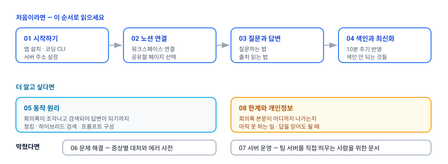

# minutes 사용 설명서

**minutes**는 팀의 노션 회의록을 색인해 두고, "그때 로그인 방식 뭘로 정했지?" 같은 자연어 질문에 **출처 링크와 함께** 답해 주는 데스크톱 앱입니다.

이 폴더는 minutes를 처음 쓰는 사람부터 서버를 운영하는 사람까지 필요한 내용을 나눠 담은 설명서입니다.

---

## 처음이라면 이 순서로

| # | 문서 | 이런 걸 알 수 있습니다 |
|---|---|---|
| 01 | [시작하기](01-getting-started.md) | 준비물 3가지, 코딩 CLI 설치, 서버 주소 설정, 첫 실행 화면 |
| 02 | [노션 워크스페이스 연결](02-notion-connect.md) | 노션 연결 버튼을 누른 뒤 벌어지는 일, 어떤 페이지를 공유할지 고르는 법 |
| 03 | [질문과 답변](03-asking-questions.md) | 질문하는 법, 대기 문구의 의미, `[출처 N]`과 출처 카드 읽는 법, 잘 찾히는 질문 요령 |
| 04 | [색인과 최신화](04-indexing.md) | 노션을 고쳤는데 검색이 안 될 때, 재색인 버튼, 애초에 색인되지 않는 것들 |

## 더 알고 싶다면

| # | 문서 | 이런 걸 알 수 있습니다 |
|---|---|---|
| 05 | [동작 원리](05-how-it-works.md) | 회의록이 조각나고 검색되어 답변이 되기까지의 전 과정 |
| 08 | [한계와 개인정보](08-limits-and-privacy.md) | 회의록 내용이 어디까지 나가는지, 아직 못 하는 일, 답을 믿어도 될 때 |

## 막혔다면

| # | 문서 | 이런 걸 알 수 있습니다 |
|---|---|---|
| 06 | [문제 해결](06-troubleshooting.md) | 증상별 대처, 에러 메시지 사전 |
| 07 | [서버 운영](07-server-admin.md) | 팀 서버를 직접 띄우는 사람을 위한 설치·환경변수·API·백업 |

---

## 상황별 바로가기

| 상황 | 볼 곳 |
|---|---|
| 앱은 켰는데 답변이 안 나옵니다 | [코딩 CLI 준비](01-getting-started.md#1-코딩-cli-준비하기) → [문제 해결](06-troubleshooting.md) |
| 노션 연결이 안 끝납니다 | [노션 연결](02-notion-connect.md) |
| 어제 쓴 회의록이 검색되지 않습니다 | [색인과 최신화](04-indexing.md) |
| 답변이 엉뚱한 문서를 인용합니다 | [잘 찾히는 질문 쓰기](03-asking-questions.md) → [동작 원리](05-how-it-works.md) |
| 연결할 워크스페이스를 바꾸고 싶습니다 | [노션 연결](02-notion-connect.md) |
| 회의록이 외부로 나가는지 확인해야 합니다 | [한계와 개인정보](08-limits-and-privacy.md) |
| 서버가 뜨자마자 죽습니다 | [서버 운영](07-server-admin.md) |

---

## 30초 요약

- **색인**은 팀 서버가 합니다. 내가 노션에서 공유한 페이지만 읽어 조각으로 나눠 보관하고, **10분마다** 변경분을 반영합니다.
- **검색**도 팀 서버가 합니다. 질문과 가장 관련 있는 조각 8개를 골라 돌려줍니다. 내 워크스페이스 범위를 벗어나지 않습니다.
- **답변 생성**은 내 PC에 설치된 코딩 CLI(`claude` / `codex` / `gemini`)가 합니다. 서버에는 API 키가 없습니다.
- 답변의 `[출처 N]`을 누르면 노션 원문으로 이동합니다. **출처가 붙지 않은 답변은 그대로 믿지 마세요.**

> ⚠️ 현재 임베딩에 Gemini API 무료 티어를 쓰고 있어 **회의록 본문이 외부로 나갑니다.** 자세한 내용과 대응은 [한계와 개인정보](08-limits-and-privacy.md)를 반드시 확인하세요.

---

## 이 문서들에 대해

- 설명서는 실제 코드 동작을 기준으로 작성했습니다. 아직 구현되지 않았거나 함정이 되는 부분은 `> ⚠️` 표시로 남겨 두었습니다.
- 제품의 설계 원본(SSOT)은 저장소의 [`.claude/skills/rag-implementation/`](../.claude/skills/rag-implementation/)입니다. 설계와 구현이 어긋나는 지점은 각 문서에서 따로 표시했습니다.
